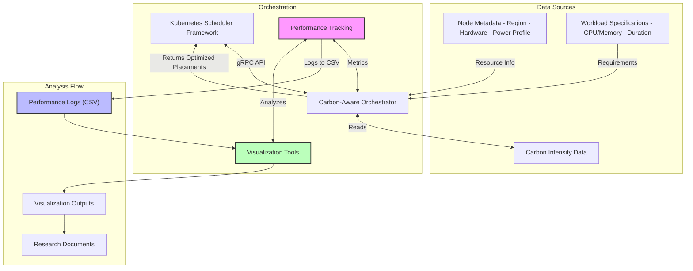

# Carbon-Aware Orchestrator

This repository contains the implementation of a carbon-aware orchestrator that optimizes workload placement based on both operational and embodied carbon emissions. It integrates with Kubernetes scheduling through a custom scheduler plugin, allowing for environmentally-conscious placement decisions.

This work is based on the original scheduler plugin developed by Fondazione Bruno Kessler (FBK).

## Table of Contents

- [Overview](#overview)
- [The IDL](#the-idl)
- [Repository Structure](#repository-structure)
- [Carbon-Aware Algorithm](#carbon-aware-algorithm)
- [Carbon-Aware Data Model](#carbon-aware-data-model)
- [Node Metadata](#node-metadata)
- [Workload Specifications](#workload-specifications)
- [Carbon Emissions Model](#carbon-emissions-model)
- [Getting Started](#getting-started)
    - [Prerequisites](#prerequisites)
    - [Setup Environment](#setup-environment)
    - [Configure Test Infrastructure and Workloads](#configure-test-infrastructure-and-workloads)
    - [Generate Test Data](#generate-test-data)
    - [Run the Experiment](#run-the-experiment)
    - [Performance Metrics](#performance-metrics)
    - [Visualizing Results](#visualizing-results)
- [Recent Updates](#recent-updates)
    - [Automatic Performance Metrics Tracking](#automatic-performance-metrics-tracking)
    - [Comprehensive Visualization Toolkit](#comprehensive-visualization-toolkit)

## Overview

The carbon-aware orchestrator considers multiple factors when placing workloads:

1. **Operational carbon emissions**: Based on regional carbon intensity forecasts and the power consumption model of each node
2. **Embodied carbon emissions**: Accounting for hardware manufacturing emissions amortized over device lifetime
3. **Node characteristics**: Including hardware type, region, and resource constraints
4. **Workload characteristics**: Including duration, resource requirements, and constraints

## The IDL 

The interface definition is in the `./pkg/idl/idl.proto` file. It models the snapshot of a Kubernetes cluster in terms of infrastructure and workload deployment, along with placement information including scheduling time for each microservice and scores for each pod and node. This gRPC interface decouples the FogAtlas code (written in Go) from the placement algorithm implementations that can be written in various programming languages.

## Repository Structure

- `pkg/idl/`: gRPC interface definition
- `pkg/carbon-aware/`: Implementation of the carbon-aware scheduling algorithm
    - `server-python/`: Python implementation 
    - `client/`: Go client for testing
    - `infra_workload_gen.py`: Tool for generating test infrastructure and workload data
    - `performance_logs/`: Directory containing performance metrics logs
- `analysis/`: Tools for analyzing and visualizing performance data
    - `visualization.py`: Script for generating performance visualizations
    - `schedule_visualization.py`: Script for visualizing pod placement schedules
    - `run_schedule_visualization.sh`: Helper script for running schedule visualizations
    - `VISUALIZATION_GUIDE.md`: Documentation for using visualizations

## Carbon-Aware Algorithm

The carbon-aware algorithm optimizes workload placement based on total carbon emissions.

The usage workflow is:
1. The client initializes the algorithm with `Init()`
2. The client provides the current cluster status to the algorithm via `CalculatePlacement()`, which returns scores for each node-pod pairing

The algorithm evaluates:
- Node power consumption models
- Regional carbon intensity data
- Embodied carbon amortization
- Workload resource requirements and duration
- Current cluster utilization

## Carbon-Aware Data Model

### Node Metadata

Nodes include detailed hardware information through Kubernetes labels and annotations:

- **Region**: `topology.kubernetes.io/region` (e.g., "DE", "FR")
- **Hardware subcategory**: `hardware.carbon/subcategory` (e.g., "Server", "Laptop", "IoT")
- **Embodied carbon**: `hardware.carbon/embodied_emissions` (kgCO2e)
- **Lifetime**: `hardware.carbon/lifetime_years` (years)
- **Power consumption**:
    - `hardware.power/idle_watts`: Base power consumption when idle
    - `hardware.power/active_watts`: Typical power when active
    - `hardware.power/max_watts`: Maximum power at full utilization

### Workload Specifications

Workloads include resource requirements and time parameters:

- **CPU and Memory**: Standard Kubernetes resource requests
- **Duration**: How long the workload will run, specified via annotation `workload.carbon/duration_hours`

## Carbon Emissions Model

The scheduler calculates emissions for each potential node-workload pairing using:

1. **Dynamic power model**: `idle + (max-active) * CPU_usage_ratio`
2. **Operational emissions**: `power * duration * carbon_intensity`
3. **Embodied emissions**: `(embodied_carbon / lifetime_hours) * duration`
4. **Total emissions**: Sum of operational and embodied emissions

## Getting Started

### Prerequisites

- Kubernetes cluster (v1.21+)
- Go 1.18+
- Python 3.9+

### Setup Environment

```bash
# Clone the repository
git clone https://github.com/nasadov/carbon-aware-orchestrator.git
cd carbon-aware-orchestrator

# Install required Python dependencies
pip install -r pkg/carbon-aware/server-python/requirements.txt

# Install additional dependencies for visualization
pip install matplotlib pandas seaborn
```

### Configure Test Infrastructure and Workloads

Open `infra-workload-config.yaml` and adjust the configuration:
```yaml
nodes:
    # Number of nodes to generate
    num_nodes: 8
    
    # Regions that match carbon intensity forecast regions
    regions:
        - DE
        - FR
        - ES
        - IT-NO
        
    # Method to assign regions to nodes ("cycle" or "random")
    assignment_method: cycle
    
    # Hardware subcategories configuration with power and embodied carbon profiles
    hardware_subcategories:
        IoT:
            cpu: "2"
            memory: "2Gi"
            embodied_carbon: 27.471
            lifetime: 5.2
            power:
                idle: 0.5
                active: 2.0
                max: 5.0
        # Additional hardware profiles...
    
    # Method to assign hardware types to nodes
    # - "cycle": Simple cycling through hardware types
    # - "random": Random assignment with fixed seed
    # - "shifted_cycle": Advanced cycling that ensures diverse region-hardware mappings
    hardware_assignment_method: shifted_cycle
    
    # Offset for shifted_cycle (how many positions to shift each cycle)
    hardware_cycle_offset: 1

workload:
    # Directory to output workload files
    output_dir: workloads
    
    # Number of timeslots to generate (e.g., 24 for each hour in a day)
    num_timeslots: 24
    
    # Lambda parameter for Poisson distribution (average services per timeslot)
    poisson_lambda: 4
    
    # Minimum number of services per timeslot
    min_services: 1
    
    # Available duration values (in hours)
    durations:
        - 1  # short duration
        - 3  # medium duration 
        - 6  # long duration
    
    # Method for assigning durations ("cycle" or "random")
    duration_assignment_method: cycle
    
    # Strategy for determining deadlines
    # - "tight": Deadline equals duration (no flexibility)
    # - "flexible": Duration plus variable flexibility
    # - "mixed": Mix of tight and flexible deadlines
    # - "exact": Deadline is exactly 2x duration
    deadline_strategy: flexible
    
    # Hours to add to duration for flexible deadlines
    deadline_flexibility_hours:
        - 1   # Low flexibility
        - 3   # Medium flexibility
        - 6   # High flexibility
    
    # Available CPU request options
    cpu_options:
        - 1000m
        - 500m
        - 250m
        - 100m
    
    # Available memory request options
    mem_options:
        - 1Gi
        - 512Mi
        - 256Mi
        - 128Mi
```

### Generate Test Data

```bash
# Generate infrastructure and workload data based on your config
python pkg/carbon-aware/infra_workload_gen.py
```
This will create:
- `nodes.yaml`: Infrastructure definitions with hardware characteristics and regional assignments
- `workloads/timeslot_*.yaml`: Directory containing workload definitions for each timeslot

The `shifted_cycle` hardware assignment method creates different hardware-region combinations across nodes, making tests more realistic.

### Run the Experiment

```bash
# Start the Python server
cd pkg/carbon-aware/server-python
python main.py &

# In a new terminal, run the Go client with the test data
cd pkg/carbon-aware/client
go run client-test.go
```

### Performance Metrics

The orchestrator automatically tracks detailed performance metrics for each scheduling run. These metrics are stored in CSV format in the `pkg/carbon-aware/server-python/performance_logs/` directory.

Performance tracking includes:
- Execution time (total and per-pod)
- Number of pods processed, placed, failed, and skipped
- Total and per-pod carbon emissions
- CPU and memory utilization
- Algorithm-specific metrics (iterations, steps)
- Number of scheduling options considered
- Region diversity information
- Hardware type distributions

The metrics are logged automatically without needing any special flags. Each log file is named with the algorithm and timestamp (e.g., `heuristic_20250512_121534.csv`).

### Visualizing Results

The repository includes visualization tools for analyzing performance data and pod placement schedules.

**1. Performance Metrics Visualization:**

```bash
# Navigate to the analysis directory
cd analysis

# Generate visualizations from a performance log file
python visualization.py --log-file ../pkg/carbon-aware/server-python/performance_logs/heuristic_YYYYMMDD_HHMMSS.csv
```

This script (`analysis/visualization.py`) generates various plots related to algorithm performance, such as execution time, carbon emissions, and scalability. For detailed instructions, see `analysis/VISUALIZATION_GUIDE.md`. Plots are saved in the `figures/` directory, typically within a subdirectory named after the log file or a custom comparison name.

**2. Pod Placement Schedule Visualization:**

A new system has been implemented to track and visualize the actual pod placements made by the scheduling algorithms.

*   **CSV Tracking:**
    *   Both `HeuristicAlgorithm` and `GlobalOptimalAlgorithm` now log their pod placement decisions to CSV files.
    *   These CSVs are stored in timestamped, algorithm-specific subdirectories within the `analysis/` directory (e.g., `analysis/heuristic_YYYYMMDD_HHMMSS/heuristic_placements_YYYYMMDD_HHMMSS.csv`).
    *   Each directory also contains a symlink (e.g., `heuristic_placements.csv`) pointing to the latest run's CSV for easier access.
    *   The logged data includes `pod_id`, `node_id`, `start_slot`, `duration`, and for the global optimal algorithm, additional metrics like `cpu_request`, `ram_request`, `total_carbon_emissions`, and solver details.

*   **Visualization Script (`analysis/schedule_visualization.py`):**
    *   This script reads the placement CSVs and generates two types of plots:
        1.  **Individual Pod Plot:** A matrix showing which pods are on which nodes at each time slot.
        2.  **Density Heatmap:** A heatmap showing the number of pods (density) on each node at each time slot.
    *   Plots are saved in the `figures/` directory, within a subdirectory named after the algorithm and timestamp (e.g., `figures/heuristic_YYYYMMDD_HHMMSS/`) or a custom name if provided.

*   **Helper Script (`run_schedule_visualization.sh`):**
    *   This shell script simplifies running the `schedule_visualization.py` script.
    *   It provides options to specify input CSVs (including glob patterns), output directory, visualization mode (`individual`, `density`, or `all`), and a name for the visualization run.

**Example usage for schedule visualization:**

```bash
# From the project root directory
./run_schedule_visualization.sh -n "Heuristic_Run_1" -m all analysis/heuristic_YYYYMMDD_HHMMSS/heuristic_placements_YYYYMMDD_HHMMSS.csv

# To visualize all heuristic placements by pattern
./run_schedule_visualization.sh -n "All_Heuristic_Runs" analysis/heuristic_*/heuristic_placements_*.csv
```

This will generate plots in `figures/Heuristic_Run_1/` or `figures/All_Heuristic_Runs/` respectively.

## Recent Updates

### Automatic Performance Metrics Tracking

The Carbon-Aware Orchestrator now tracks performance metrics by default. Previously, you needed to use the `--perf-log` flag to enable this feature. Now, all experiments automatically save performance data, which helps with:

- Comparing how the algorithm performs across multiple runs
- Comparing different algorithms
- Creating useful visualizations
- Understanding how placement decisions affect carbon emissions
- Tracking system performance over time
- Finding ways to improve

This change was made in the server's main code so that all runs collect the same metrics without needing extra settings. The metrics include timing, throughput, carbon impact, and resource use.

Performance logs are saved as CSV files in the `pkg/carbon-aware/server-python/performance_logs/` directory. Each file is named with the algorithm type and timestamp (e.g., `heuristic_20250512_121534.csv`).

### Comprehensive Visualization Toolkit

The visualization capabilities have been significantly enhanced:

*   **Performance Visualization (`analysis/visualization.py`):**
    *   Generates six types of charts from performance log CSVs (execution time, carbon emissions, scalability, etc.).
    *   Outputs are saved to `figures/[comparison_name_or_log_name]/`.
    *   Detailed guide: `analysis/VISUALIZATION_GUIDE.md`.

*   **Pod Placement Visualization (`analysis/schedule_visualization.py` and `run_schedule_visualization.sh`):**
    *   **Tracking:** Algorithms now log detailed pod placements (pod ID, node, start time, duration) to CSV files in `analysis/[algorithm_name_timestamp]/`.
    *   **Visualization:** The new script `analysis/schedule_visualization.py` (runnable via `run_schedule_visualization.sh`) creates:
        *   **Individual Pod Plots:** Matrix view of pods on nodes over time.
        *   **Density Heatmaps:** Heatmap of pod density on nodes over time.
    *   **Output:** Plots are saved in `figures/[run_name_or_timestamp]/`. This allows for a clear visual understanding of how different algorithms schedule pods across the cluster.

These tools provide a comprehensive suite for analyzing both the performance characteristics of the scheduling algorithms and the specifics of the pod placements they decide.

## Architecture

The carbon-aware orchestrator follows this architecture for making placement decisions:



The diagram shows how performance tracking (pink) creates CSV logs (blue) that visualization tools (green) can analyze to help improve the orchestrator.

The architecture includes performance tracking and visualization tools to help analyze how the orchestrator works.

## Contributing

Contributions to improve the carbon-aware scheduler are welcome. Please follow these steps:

1. Fork the repository
2. Create a feature branch
3. Submit a pull request with detailed description

## License

This project is licensed under the Apache License 2.0 - see the LICENSE file for details.

## Acknowledgements

- Fondazione Bruno Kessler (FBK) for the original scheduler plugin
- Electricity Maps for granting access to their carbon intensity data
