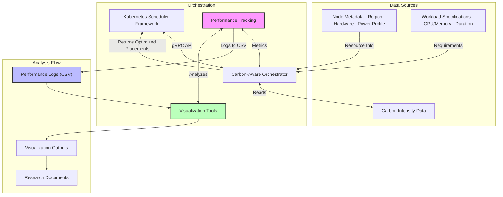

# Carbon-Aware Orchestrator

This repository contains an experimental implementation of a carbon-aware orchestrator that optimizes workload placement based on both operational and embodied carbon emissions. The goal is to explore environmentally-conscious placement decisions within Kubernetes scheduling frameworks.

This work builds upon the original scheduler plugin developed by Fondazione Bruno Kessler (FBK), and remains an ongoing research project.

## Table of Contents

- [Overview](#overview)
- [The IDL](#the-idl)
- [Repository Structure](#repository-structure)
- [Carbon-Aware Algorithm](#carbon-aware-algorithm)
    - [Heuristic Algorithm](#heuristic-algorithm)
    - [MILP Global Optimizer](#milp-global-optimizer)
    - [Carbon-Agnostic (vanilla k8s-like) Baseline](#carbon-agnostic-vanilla-k8s-like-baseline)
    - [Constraints Handling](#constraints-handling)
- [Carbon-Aware Data Model](#carbon-aware-data-model)
- [Node Metadata](#node-metadata)
- [Workload Specifications](#workload-specifications)
- [Carbon Emissions Model](#carbon-emissions-model)
- [Embodied Carbon Allocation Modes](#embodied-carbon-allocation-modes)
- [Carbon Units Documentation](docs/carbon_units.md)
- [Getting Started](#getting-started)
    - [Prerequisites](#prerequisites)
    - [Setup Environment](#setup-environment)
    - [Configure Test Infrastructure and Workloads](#configure-test-infrastructure-and-workloads)
    - [Generate Test Data](#generate-test-data)
    - [Run the Experiment](#run-the-experiment)
    - [MILP Global Optimizer](#running-milp-global-optimizer)
    - [Verify Constraint Enforcement](#verify-constraint-enforcement)
    - [Performance Metrics](#performance-metrics)
    - [Carbon Emissions Analysis](#carbon-emissions-analysis)
    - [Visualizing Results](#visualizing-results)

## Overview

The carbon-aware orchestrator considers multiple factors when placing workloads:

1. **Operational carbon emissions**: Estimates based on regional carbon intensity forecasts and power consumption models
2. **Embodied carbon emissions**: Approximations of hardware manufacturing emissions amortized over device lifetime
3. **Node characteristics**: Including hardware type, region, and resource constraints
4. **Workload characteristics**: Including duration, resource requirements, and constraints

This is experimental work and the accuracy of carbon calculations depends on the quality of input data and modeling assumptions.

## The IDL 

The interface definition is in the `./pkg/idl/idl.proto` file. It models a snapshot of a Kubernetes cluster in terms of infrastructure and workload deployment, along with placement information including scheduling time for each microservice and scores for each pod and node. This gRPC interface decouples the FogAtlas code (written in Go) from the placement algorithm implementations that can be written in various programming languages.

## Repository Structure

- `pkg/idl/`: gRPC interface definition
- `pkg/carbon-aware/`: Implementation of the carbon-aware scheduling algorithm
    - `server-python/`: Python implementation 
    - `client/`: Go client for testing
    - `infra_workload_gen.py`: Tool for generating test infrastructure and workload data
    - `performance_logs/`: Directory containing performance metrics logs
    - `nodes.yaml`: Node configuration with CPU capacities and hardware metadata
- `tests/`: Testing tools and experimental results
    - `milp_global_optimizer.py`: MILP-based global optimization algorithm
    - `experiments/`: Generated experiment results from MILP runs
    - `check_timeslot_constraints.py`: Constraint validation tools
- `analysis/`: Tools for analyzing and visualizing performance data
    - `schedule_visualization.py`: Enhanced script for visualizing pod placement schedules
    - `visualization.py`: Script for generating performance visualizations
    - `simple_carbon_heatmap.py`: Carbon emissions visualization tools
    - `carbon_emissions_comparison.py`: Comprehensive analysis comparing carbon emissions across algorithms
    - `emissions_vs_pods_plot_generator.py`: Plot total and per‑pod emissions vs. pod count (Vanilla/Heuristic/Global‑Optimal)
    - `success_rate_plot_generator.py`: Plot scheduling success rate vs. pod count (multi‑algorithm)
    - `time_complexity_plot_generator.py`: Plot precompute time vs. pods/nodes for heuristic, global‑optimal, and vanilla
    - `time_complexity_sweep.py`: Scripted sweep to generate runtime scaling datasets (pods × nodes) for any algorithm
    - `fix_start_slots.py`: Tool for fixing timeslot inconsistencies in placement data for vanilla algorithm
- `figures/`: Generated visualization outputs organized by experiment
    - `Comparison/Carbon_Emissions_Analysis_TIMESTAMP/`: Carbon emissions comparison results with automatic timestamping
    - `Algorithm_Comparison_Latest/`: Multi-algorithm performance comparisons
    - `Heuristic_Latest/`, `Global_Optimal_Latest/`: Algorithm-specific visualizations
- `docs/`: Documentation including research papers and guides
    - `schedule_visualization.py`: Script for visualizing pod placement schedules
    - `run_schedule_visualization.sh`: Helper script for running schedule visualizations
    - `VISUALIZATION_GUIDE.md`: Documentation for using visualizations

## Carbon-Aware Algorithm

The carbon-aware orchestrator currently provides two scheduling approaches, both of which are still under active development and may have limitations:

### Heuristic Algorithm

The heuristic algorithm provides reasonable placement decisions by:

1. **Carbon Score Calculation**: For each pod-node pairing, calculating total carbon emissions (operational + embodied)
2. **Constraint Filtering**: Ensuring resource requirements and timing constraints are met
3. **Greedy Selection**: Choosing the node with lowest carbon emissions for each pod

This approach is fast and practical, but may not always find the global optimum. In our implementation, we added three modest refinements to improve practicality without changing the core objective:

- Tightest‑window‑first ordering, then larger pods (CPU/RAM/duration), to reduce early fragmentation and deadline misses.
- Low‑carbon timeslot ordering, checking greener hours earlier when building candidates.
- A lightweight packing‑aware tie‑breaker: when emissions are essentially equal, prefer placements that leave less normalized leftover CPU/RAM across the pod’s active hours. The atomic path also uses proportional embodied allocation by default for consistency with the non‑atomic path.

### MILP Global Optimizer

The Mixed Integer Linear Programming (MILP) optimizer finds globally optimal solutions by:

1. **Mathematical Modeling**: Formulating the entire scheduling problem as a linear program
2. **Global Optimization**: Finding the best solution across all pods and nodes simultaneously
3. **Constraint Satisfaction**: Guaranteeing all resource and timing constraints are respected
4. **Solver Integration**: Using CBC (Coin-OR), CPLEX, or Gurobi for optimization

The MILP optimizer supports two optimization approaches:

#### Lexicographic Optimization (Recommended)

The global optimizer uses a robust **lexicographic two‑phase** method by default:

1. **Phase 1 (Placement Feasibility)**: Minimize the number of unplaced pods. This yields the exact set of pods that cannot be placed under constraints (CPU/RAM, earliest start, deadline, duration across slots).
2. **Phase 2 (Emissions Minimization)**: Minimize total emissions among all solutions with the same optimal unplaced set found in Phase 1.

Key details of Phase 2 objective and constraints:
- **Dynamic emissions**: Linear in CPU share with coefficient `(P_max - P_active)` and per‑slot carbon intensity.
- **Idle + embodied emissions**: Paid once per `(node, slot)` activation via binary `y[node, slot]` and linked with big‑M to CPU usage.
- **Exact unplaced set fixed**: The set `s[pod] ∈ {0,1}` from Phase 1 is fixed in Phase 2 to reduce search space and ensure feasibility.
- **Warm start**: Phase 2 is warm‑started from Phase 1 decisions when supported by the solver.
- **Dynamic‑only fallback**: If the full Phase 2 (with activations) times out, a lighter Phase 2 variant that minimizes dynamic emissions only (no `y` activation terms) is attempted to ensure progress on larger instances while still optimizing carbon.

#### Standard Optimization

The traditional single-phase optimization that directly minimizes carbon emissions with mandatory placement constraints (`== 1` for each pod).

#### Configuration

The optimization approach can be configured in `infra-workload-config.yaml`:

```yaml
# Global optimization algorithm configuration
optimization:
  # Use lexicographic optimization (Phase 1: placements, Phase 2: emissions)
  use_lexicographic: true
  
  # Solver configuration
  solver:
    name: cp_sat     # cp_sat|highs|gurobi|cplex|cbc
    time_limit: 60   # seconds per phase
    gap_tolerance: 0.05
    threads: 8
```

#### Running MILP Global Optimizer

```bash
# Run with lexicographic optimization (default)
cd pkg/carbon-aware/server-python
python main.py --algorithm global-optimal --workloads-dir ../workloads \
    --nodes-file ../nodes.yaml --forecasts-file all_forecasts.json \
    --experiment --experiment-dir experiments/lexicographic_test

# Or run standalone tests
cd tests
python test_lexicographic_optimization.py

# Results are saved to experiments/ directory with timestamp
```

The MILP optimizer is also available in `tests/milp_global_optimizer.py` for standalone testing and generates experiment results for comparison with heuristic approaches. Please note that this is an experimental feature and may require significant computational resources for larger problems.

### Carbon-Agnostic (vanilla k8s-like) Baseline

The carbon-agnostic baseline (vanilla k8s-like) simulates a Kubernetes-default-inspired scheduler to provide a robust, apples-to-apples comparison against carbon-aware methods.

Key properties:

1. **Filter → Score → Select**: mirrors kube-scheduler structure.
2. **Feasibility**: CPU/RAM must be available across the pod's labeled duration on a node for a chosen start slot.
3. **Scoring (LeastAllocated-like)**: prefers nodes with higher free CPU and RAM fractions (equal weights).
4. **Earliest timeslot respected**: pods from `timeslot_X.yaml` can only start at or after X.
5. **No carbon signals**: ignores carbon intensity and embodied emissions; returns 0.0 emissions in placements.

Run precompute (offline, capacity-safe):

```bash
python3 pkg/carbon-aware/server-python/main.py \
  --algorithm vanilla \
  --precompute \
  --workloads-dir pkg/carbon-aware/workloads \
  --nodes-file pkg/carbon-aware/nodes.yaml \
  --forecasts-file pkg/carbon-aware/server-python/all_forecasts.json \
  --experiment-dir experiments/manual_precompute \
  --loglevel INFO
```

Outputs: a timestamped directory under `experiments/manual_precompute/vanilla_*` with `vanilla_placements_session.csv`.

Notes and caveats:

- Real kube-scheduler is instantaneous (no time horizon), and can consider many plugins (taints/tolerations, affinity, topology spread, volumes), priorities, and preemption. The simulator focuses on CPU/RAM feasibility with a simple LeastAllocated-like score to create a consistent baseline over the same timeslot horizon used by heuristic and MILP.
- For higher fidelity, we can incrementally add plugin-like filters (taints, affinity), spread constraints, and weighted multi-plugin scoring.

### Constraints Handling

The algorithm enforces several constraints when placing workloads:

- **Resource constraints**: Ensuring pods have enough CPU and memory
- **Deadline constraints**: Making sure workloads complete before their specified deadlines
- **Earliest timeslot constraint**: Pods from timeslot_X.yaml files are only scheduled at or after timeslot X

Both the heuristic and global optimization (MILP) algorithms properly enforce the earliest_timeslot constraint, which is a key real-world operational requirement. This implementation includes:
- Mapping pod IDs to their source files to determine the earliest valid timeslot
- Validating all potential placements against the earliest_timeslot constraint
- Special handling in the MILP formulation for the global optimal algorithm

## Carbon-Aware Data Model

### Node Metadata

Nodes include detailed hardware information through Kubernetes labels and annotations:

- **Region**: `topology.kubernetes.io/region` (e.g., "DE", "FR")
- **Hardware subcategory**: `hardware.carbon/subcategory` (e.g., "Server", "Laptop", "IoT")
- **Embodied carbon**: `hardware.carbon/embodied_emissions` (kgCO2e)
- **Lifetime**: `hardware.carbon/lifetime_years` (years)
- **Power consumption**:
    - `hardware.power/idle_watts`: Base power consumption when idle
    - `hardware.power/active_watts`: Typical power when active
    - `hardware.power/max_watts`: Maximum power at full utilization

### Workload Specifications

Workloads include resource requirements and time parameters:

- **CPU and Memory**: Standard Kubernetes resource requests
- **Duration**: How long the workload will run, specified via annotation `workload.carbon/duration_hours`

## Carbon Emissions Model

The scheduler calculates emissions for each potential node-workload pairing using:

1. **Dynamic power model**: `idle + (max-active) * CPU_usage_ratio` (measured in Watts)
2. **Operational emissions**: `power * duration * carbon_intensity` (measured in g CO2e)
3. **Embodied emissions**: `(embodied_carbon / lifetime_hours) * duration` (measured in g CO2e)

Updated (co-location aware) allocation:
- Node power at aggregate utilization U = sum_i (cpu_i / CPU_total): `P_node = P_idle + (P_max - P_active) * U`.
- Idle and embodied are paid once per (node,timeslot) when any pod is present; dynamic is linear in CPU share.
- Per-pod allocation: `dynamic_i = (P_max - P_active) * u_i`, and idle+embodied are allocated proportionally to `u_i / U` across active pods in that slot.
- The MILP objective mirrors this: dynamic terms per placement and a binary `y[node,slot]` to pay idle+embodied once per active slot.

**Important**: All embodied carbon values in configuration files are specified in whole grams (g CO2e), not kilograms. For detailed information about units and calculation methods, see the [Carbon Units Documentation](docs/carbon_units.md).

## Embodied Carbon Allocation Modes

We support two embodied-carbon allocation modes for per‑pod attribution, selectable at runtime. The default is proportional.

- **Mode (CLI flag)**: `--embodied-mode {proportional|uniform}` (default: `proportional`)
  - Applies to `--algorithm heuristic` and `--algorithm global-optimal` execution paths.
  - For convenience, the sweep script runs both modes for comparison.

- **Proportional (default)**:
  - Per active node‑hour, idle power and embodied emissions are paid once at the node and then attributed to pods in proportion to their CPU share u_i/U during that hour.
  - Dynamic power remains linear in each pod’s CPU share.

- **Uniform**:
  - Per active node‑hour, idle power and embodied emissions are still paid once at the node, but the marginal accounting for the first pod that activates an otherwise idle node‑hour is the full node‑hour idle+embodied amount; co‑located pods during that hour only bear their dynamic share.
  - This emphasizes reuse/consolidation by making “turning on” a node‑hour more expensive for the first pod.

- **Idle power allocation policy** (both modes):
  - A node pays idle power once per hour if any workload is present during that hour.
  - Dynamic power is `(P_max − P_active) * U` where \(U = \sum_i u_i\) is aggregate CPU utilization fraction.

- **Totals vs attribution**:
  - Node‑hour totals (idle + dynamic + embodied) are invariant to the allocation mode. Allocation only changes how that total is split across pods.
  - Heuristic uses the mode in its marginal decision cost; MILP minimizes node‑hour totals directly (objective unaffected by the attribution rule), but outputs are still organized per mode for analysis.

- **Outputs and naming**:
  - New experiment directories include the mode suffix up front, for example:
    - `heuristic_proportional_80pods_YYYYMMDD_HHMMSS/`
    - `heuristic_uniform_120pods_YYYYMMDD_HHMMSS/`
    - `global-optimal_proportional_200pods_YYYYMMDD_HHMMSS/`
    - `global-optimal_uniform_.../`
  - Heuristic placement CSVs: `heuristic_prop_placements_session.csv` or `heuristic_uniform_placements_session.csv`.
  - Global‑optimal placement CSV: `global_optimal_placements_session.csv` (mode indicated by directory name).
  - Vanilla is allocation‑agnostic for totals and remains `vanilla_*`.

Example runs:

```bash
# Heuristic, proportional (default)
python3 pkg/carbon-aware/server-python/main.py \
  --algorithm heuristic --precompute \
  --workloads-dir pkg/carbon-aware/workloads \
  --nodes-file pkg/carbon-aware/nodes.yaml \
  --forecasts-file pkg/carbon-aware/server-python/all_forecasts.json \
  --experiment-dir experiments/manual_precompute \
  --embodied-mode proportional --loglevel INFO

# Heuristic, uniform
python3 pkg/carbon-aware/server-python/main.py \
  --algorithm heuristic --precompute \
  --workloads-dir pkg/carbon-aware/workloads \
  --nodes-file pkg/carbon-aware/nodes.yaml \
  --forecasts-file pkg/carbon-aware/server-python/all_forecasts.json \
  --experiment-dir experiments/manual_precompute \
  --embodied-mode uniform --loglevel INFO

# Global-optimal (proportional shown here)
python3 pkg/carbon-aware/server-python/main.py \
  --algorithm global-optimal --precompute \
  --workloads-dir pkg/carbon-aware/workloads \
  --nodes-file pkg/carbon-aware/nodes.yaml \
  --forecasts-file pkg/carbon-aware/server-python/all_forecasts.json \
  --experiment-dir experiments/manual_precompute \
  --embodied-mode proportional --loglevel INFO
```

Visualization note:
- `analysis/emissions_vs_pods_plot_generator.py` detects the mode from directory names and plots separate series (e.g., heuristic‑proportional vs heuristic‑uniform). Vanilla appears once as allocation‑agnostic baseline.

### Sweep script modes

The sweep helper now defaults to proportional embodied mode and supports flags to reproduce uniform or both modes:

```bash
# Default: proportional only
bash scripts/sweep_podcounts_and_precompute.sh

# Uniform only
bash scripts/sweep_podcounts_and_precompute.sh --uniform

# Both proportional and uniform (legacy behavior)
bash scripts/sweep_podcounts_and_precompute.sh --both
```

## Getting Started

### Prerequisites

- Kubernetes cluster (v1.21+)
- Go 1.18+
- Python 3.9+

### Setup Environment

```bash
# Clone the repository
git clone https://github.com/nasadov/carbon-aware-orchestrator.git
cd carbon-aware-orchestrator

# Install required Python dependencies
pip install -r pkg/carbon-aware/server-python/requirements.txt

# Install additional dependencies for visualization
pip install matplotlib pandas seaborn
```

### Configure Test Infrastructure and Workloads

Open `infra-workload-config.yaml` and adjust the configuration:
```yaml
nodes:
    # Number of nodes to generate
    num_nodes: 8
    
    # Regions that match carbon intensity forecast regions
    regions:
        - DE
        - FR
        - ES
        - IT-NO
        
    # Method to assign regions to nodes ("cycle" or "random")
    assignment_method: cycle
    
    # Hardware subcategories configuration with power and embodied carbon profiles
    hardware_subcategories:
        IoT:
            cpu: "2"
            memory: "2Gi"
            embodied_carbon: 27.471
            lifetime: 5.2
            power:
                idle: 0.5
                active: 2.0
                max: 5.0
        # Additional hardware profiles...
    
    # Method to assign hardware types to nodes
    # - "cycle": Simple cycling through hardware types
    # - "random": Random assignment with fixed seed
    # - "shifted_cycle": Advanced cycling that ensures diverse region-hardware mappings
    hardware_assignment_method: shifted_cycle
    
    # Offset for shifted_cycle (how many positions to shift each cycle)
    hardware_cycle_offset: 1

workload:
    # Directory to output workload files
    output_dir: workloads
    
    # Number of timeslots to generate (e.g., 24 for each hour in a day)
    num_timeslots: 24
    
    # Lambda parameter for Poisson distribution (average services per timeslot)
    poisson_lambda: 4
    
    # Minimum number of services per timeslot
    min_services: 1
    
    # Available duration values (in hours)
    durations:
        - 1  # short duration
        - 3  # medium duration 
        - 6  # long duration
    
    # Method for assigning durations ("cycle" or "random")
    duration_assignment_method: cycle
    
    # Strategy for determining deadlines
    # - "tight": Deadline equals duration (no flexibility)
    # - "flexible": Duration plus variable flexibility
    # - "mixed": Mix of tight and flexible deadlines
    # - "exact": Deadline is exactly 2x duration
    deadline_strategy: flexible
    
    # Hours to add to duration for flexible deadlines
    deadline_flexibility_hours:
        - 1   # Low flexibility
        - 3   # Medium flexibility
        - 6   # High flexibility
    
    # Available CPU request options
    cpu_options:
        - 1000m
        - 500m
        - 250m
        - 100m
    
    # Available memory request options
    mem_options:
        - 1Gi
        - 512Mi
        - 256Mi
        - 128Mi

    # Strategy for generating the number of pods per timeslot
    # - "poisson": draw per-timeslot counts from a Poisson(λ)
    # - "exact_total": generate an exact total and distribute across timeslots deterministically
    generation_strategy: poisson

    # Exact total pods to generate across all timeslots (used when generation_strategy: exact_total)
    exact_total_pods: 120
```

### Generate Test Data

```bash
# Generate infrastructure and workload data based on your config
python pkg/carbon-aware/infra_workload_gen.py
```
This will create:
- `nodes.yaml`: Infrastructure definitions with hardware characteristics and regional assignments
- `workloads/timeslot_*.yaml`: Directory containing workload definitions for each timeslot

The `shifted_cycle` hardware assignment method creates different hardware-region combinations across nodes, making tests more realistic.

### Run the Experiment

```bash
# Start the Python server
cd pkg/carbon-aware/server-python
python3 -m server

# In a new terminal, run the Go client with the test data
cd /root/carbon-aware-orchestrator
go run client-test.go
```

### Verify Constraint Enforcement

To verify that the earliest timeslot constraint is properly enforced in placement results:

```bash
# Check constraints on a specific experiment result CSV file
python3 tests/check_timeslot_constraints.py /path/to/your/placements_session.csv

# Example: Check the latest heuristic experiment
python3 tests/check_timeslot_constraints.py experiments/manual_precompute/heuristic_proportional_YYYYMMDD_HHMMSS/heuristic_placements_session.csv
```

The script will analyze the placements and report any constraint violations.

#### Batch validation and reporting (all experiments)

We also provide a batch validator that scans all experiment folders and writes a timestamped report under `tests/reports/` (ignored by Git):

```bash
python3 tests/validate_experiments_and_report.py \
  --experiments-dir experiments \
  --nodes-file pkg/carbon-aware/nodes.yaml \
  --workloads-dir pkg/carbon-aware/workloads \
  --workloads-vanilla-dir pkg/carbon-aware/workloads-vanilla
```

Outputs:
- CSV: `tests/reports/placement_validation_report_<timestamp>.csv`
- TXT: `tests/reports/placement_validation_report_<timestamp>.txt`

### Performance Metrics

The orchestrator automatically tracks detailed performance metrics for each scheduling run, without needing any special flags (previously the `--perf-log` flag was required). These metrics are stored in CSV format in the `pkg/carbon-aware/server-python/performance_logs/` directory.

Performance tracking includes:
- Execution time (total and per-pod)
- Number of pods processed, placed, failed, and skipped
- Total and per-pod carbon emissions
- CPU and memory utilization
- Algorithm-specific metrics (iterations, steps)
- Number of scheduling options considered
- Region diversity information
- Hardware type distributions

The automatic performance tracking helps with:
- Comparing how the algorithm performs across multiple runs
- Comparing different algorithms
- Creating useful visualizations
- Understanding how placement decisions affect carbon emissions
- Tracking system performance over time
- Finding ways to improve

Each log file is named with the algorithm and timestamp (e.g., `heuristic_20250512_121534.csv`).

### Carbon Emissions Analysis

The repository includes comprehensive tools for analyzing and comparing carbon emissions across different scheduling algorithms. The main analysis tool is `analysis/carbon_emissions_comparison.py`, which provides detailed carbon footprint comparisons between heuristic, global-optimal, and vanilla scheduling approaches.

**Key Features:**
- **Unified Carbon Calculation**: All algorithms now use the same carbon emissions calculation methodology for fair comparison
- **Detailed Breakdown**: Analysis of operational vs. embodied carbon emissions
- **Per-Pod Analysis**: Individual pod carbon footprint calculations
- **Algorithm Comparison**: Direct comparison of carbon efficiency across scheduling approaches
- **Real Data Integration**: Uses actual node specifications and carbon intensity forecasts

**Running Carbon Emissions Analysis:**

```bash
# Navigate to the analysis directory
cd analysis

# Basic usage - automatically finds latest experiments
python carbon_emissions_comparison.py

# Specify custom experiment directories
python carbon_emissions_comparison.py --heuristic-dir experiments/heuristic_perf_log_session_20250617_154028 --vanilla-dir experiments/vanilla_20250620_101010

# Specify individual files for fine-grained control
python carbon_emissions_comparison.py --heuristic-perf experiments/heuristic_session.csv --global-optimal-placement experiments/global_optimal_placements.csv

# Custom output directory
python carbon_emissions_comparison.py --output-dir custom_analysis_results

# Results are saved to figures/Comparison/Carbon_Emissions_Analysis_TIMESTAMP/
```

**Command-Line Options:**
- `--heuristic-dir`, `--global-optimal-dir`, `--vanilla-dir`: Specify experiment directories
- `--heuristic-perf`, `--heuristic-placement`: Specify individual performance and placement files
- `--output-dir`: Custom output directory for results
- `--experiments-dir`: Base directory for experiment auto-discovery

**Analysis Outputs:**
- **Carbon Emissions Comparison Chart**: Visual comparison of total emissions across algorithms
- **Algorithm Efficiency Analysis**: Performance vs. carbon emissions trade-offs
- **Simple Comparison Plot**: Clean emissions per pod comparison
- **Comprehensive Summary Report**: Detailed text report with statistics and insights
- **Per-Pod Carbon Footprint**: Individual pod placement decisions and their carbon impact


### Visualizing Results

The repository includes visualization tools for analyzing performance data and pod placement schedules.

**1. Performance Metrics Visualization:**

```bash
# Navigate to the analysis directory
cd analysis

# Generate visualizations from a performance log file
python visualization.py --log-file ../pkg/carbon-aware/server-python/performance_logs/heuristic_YYYYMMDD_HHMMSS.csv
```

This script (`analysis/visualization.py`) generates various plots related to algorithm performance, such as execution time, carbon emissions, and scalability. For detailed instructions, see `analysis/VISUALIZATION_GUIDE.md`. Plots are saved in the `figures/` directory, typically within a subdirectory named after the log file or a custom comparison name.

**2. Pod Placement Schedule Visualization:**

```bash
# Basic usage
python3 analysis/schedule_visualization.py /path/to/your/placements_session.csv

# Example: Visualize the latest heuristic experiment
python3 analysis/schedule_visualization.py experiments/manual_precompute/heuristic_proportional_YYYYMMDD_HHMMSS/heuristic_placements_session.csv

# Generate both individual and density plots
python3 analysis/schedule_visualization.py /path/to/placements.csv --mode all

# Custom output directory and run name
python3 analysis/schedule_visualization.py /path/to/placements.csv --output-dir custom_figures --run-name my_experiment
```

The visualization script creates:
- A matrix of pod placements across nodes and timeslots
- A heatmap of pod density
- Constraint satisfaction markers (if earliest timeslot is respected)

Visualization outputs are saved to the `figures/` directory in a timestamped folder.

**Additional Plot Generators:**

- Emissions vs Pods (total and per‑pod):
  ```bash
  python analysis/emissions_vs_pods_plot_generator.py
  ```
  Outputs saved under `figures/EmissionsVsPods/`.

- Success Rate vs Pods:
  ```bash
  python analysis/success_rate_plot_generator.py
  ```
  Outputs saved under `figures/SuccessRate/`.

- Time Complexity (runtime vs pods and vs nodes):
  ```bash
  # Default: latest-only, all three algorithms
  python analysis/time_complexity_plot_generator.py

  # Aggregate across all runs
  python analysis/time_complexity_plot_generator.py --all

  # Subset of algorithms
  python analysis/time_complexity_plot_generator.py --all --algorithms heuristic global-optimal
  ```
  Consumes precompute timing CSVs from `experiments/**/precompute_timing_<RUN>-<HHMMSS>.csv`; outputs saved under `figures/TimeComplexity/`.
  Also produces a combined overlay plot `time_vs_pods_all_algorithms_<timestamp>.pdf` comparing heuristic, global-optimal, and vanilla in one figure.

  To generate fresh timing data for all three algorithms across pod counts (20..200 step 20):
  ```bash
  bash scripts/sweep_podcounts_and_precompute.sh
  ```

### Heuristic Time Complexity (sweep script)

We provide a focused sweep for the heuristic algorithm that synthesizes infrastructures/workloads and measures precompute runtime across pods and nodes, writing a publication‑ready plot and CSVs.

```bash
# From repository root (algorithm can be: heuristic | vanilla | global-optimal)
python scripts/time_complexity_sweep.py \
  --algorithm heuristic \
  --node-counts 8,16,32,64 \
  --pod-counts 50,100,200,400 \
  --replicates 3 \
  --timeslots 12

# Optional knobs
#   --min-density/--max-density  filter pods-per-node ranges
#   --output-dir                 base folder for artifacts (default: experiments/time_complexity)
#   --run-name                   custom run stamp
#   --keep-artifacts             keep generated nodes/workloads
#   --prioritize-efficiency      (heuristic only)
#   --operational-only           (heuristic/global-optimal)
#   --embodied-mode              proportional|uniform (heuristic/global-optimal; default: proportional)
```

Outputs under `experiments/time_complexity/<stamp>/`:

- `<algo>_time_complexity_results.csv` (e.g., `heuristic_time_complexity_results.csv`): per‑run timing metrics and metadata
- `artifacts/…`: generated nodes/workloads (if `--keep-artifacts`)
- `logs/…/<algo>_performance.csv`: per‑call timings
- `<algo>_time_complexity.png` and `.pdf`: runtime vs total pods, grouped by node count (median ±1σ)

Use these artifacts directly, or feed the timing CSVs into `analysis/time_complexity_plot_generator.py` for multi‑algorithm overlays.

**3. CSV Tracking and Output Details:**

*   **CSV Tracking:**
    *   Both `HeuristicAlgorithm` and `GlobalOptimalAlgorithm` now log their pod placement decisions to CSV files.
    *   These CSVs are stored in timestamped, algorithm-specific subdirectories within the `analysis/` directory (e.g., `analysis/heuristic_YYYYMMDD_HHMMSS/heuristic_placements_YYYYMMDD_HHMMSS.csv`).
    *   Each directory also contains a symlink (e.g., `heuristic_placements.csv`) pointing to the latest run's CSV for easier access.
    *   The logged data includes `pod_id`, `node_id`, `start_slot`, `duration`, and for the global optimal algorithm, additional metrics like `cpu_request`, `ram_request`, `total_carbon_emissions`, and solver details.

*   **Helper Script (`run_schedule_visualization.sh`):**
    *   This shell script simplifies running the `schedule_visualization.py` script.
    *   It provides options to specify input CSVs (including glob patterns), output directory, visualization mode (`individual`, `density`, or `all`), and a name for the visualization run.

The comprehensive visualization toolkit allows for detailed analysis of both algorithm performance characteristics and specifics of pod placements across the cluster.


## Architecture

The carbon-aware orchestrator follows this architecture for making placement decisions:



The diagram shows how performance tracking (pink) creates CSV logs (blue) that visualization tools (green) can analyze to help improve the orchestrator.

The architecture includes:
- **Performance tracking** for detailed algorithm metrics
- **Carbon emissions analysis** for comparing algorithmic carbon efficiency
- **Visualization tools** for analyzing placement decisions and performance characteristics
- **Multi-algorithm support** enabling comparison between heuristic, global-optimal, and vanilla approaches

## Contributing

Contributions to improve the carbon-aware scheduler are welcome. Please follow these steps:

1. Fork the repository
2. Create a feature branch
3. Submit a pull request with detailed description

## License

This project is licensed under the Apache License 2.0 - see the LICENSE file for details.

## Acknowledgements

- Fondazione Bruno Kessler (FBK) for the original scheduler plugin
- Electricity Maps for granting access to their carbon intensity data
