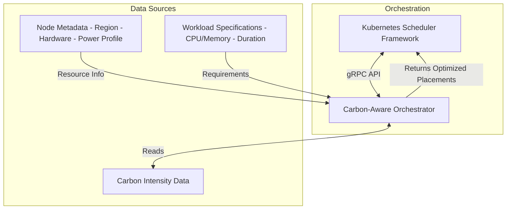

# Carbon-Aware Orchestrator

This repository contains the implementation of a carbon-aware orchestrator that optimizes workload placement based on both operational and embodied carbon emissions. It integrates with Kubernetes scheduling through a custom scheduler plugin, allowing for environmentally-conscious placement decisions.

This work is based on the original scheduler plugin developed by Fondazione Bruno Kessler (FBK).

## Table of Contents

- [Overview](#overview)
- [The IDL](#the-idl)
- [Repository Structure](#repository-structure)
- [Carbon-Aware Algorithm](#carbon-aware-algorithm)
- [Carbon-Aware Data Model](#carbon-aware-data-model)
- [Node Metadata](#node-metadata)
- [Workload Specifications](#workload-specifications)
- [Carbon Emissions Model](#carbon-emissions-model)
- [Getting Started](#getting-started)
    - [Prerequisites](#prerequisites)
    - [Setup Environment](#setup-environment)
    - [Configure Test Infrastructure and Workloads](#configure-test-infrastructure-and-workloads)
    - [Generate Test Data](#generate-test-data)
    - [Run the Experiment](#run-the-experiment)

## Overview

The carbon-aware orchestrator considers multiple factors when placing workloads:

1. **Operational carbon emissions**: Based on regional carbon intensity forecasts and the power consumption model of each node
2. **Embodied carbon emissions**: Accounting for hardware manufacturing emissions amortized over device lifetime
3. **Node characteristics**: Including hardware type, region, and resource constraints
4. **Workload characteristics**: Including duration, resource requirements, and constraints

## The IDL 

The interface definition is in the `./pkg/idl/idl.proto` file. It models the snapshot of a Kubernetes cluster in terms of infrastructure and workload deployment, along with placement information including scheduling time for each microservice and scores for each pod and node. This gRPC interface decouples the FogAtlas code (written in Go) from the placement algorithm implementations that can be written in various programming languages.

## Repository Structure

- `pkg/idl/`: gRPC interface definition
- `pkg/algorithm/`: Implementation of the carbon-aware scheduling algorithm
    - `server-python/`: Python implementation 
    - `client-go/`: Go client for testing
    - `infra_workload_gen.py`: Tool for generating test infrastructure and workload data

## Carbon-Aware Algorithm

The carbon-aware algorithm optimizes workload placement based on total carbon emissions.

The usage workflow is:
1. The client initializes the algorithm with `Init()`
2. The client provides the current cluster status to the algorithm via `CalculatePlacement()`, which returns scores for each node-pod pairing

The algorithm evaluates:
- Node power consumption models
- Regional carbon intensity data
- Embodied carbon amortization
- Workload resource requirements and duration
- Current cluster utilization

## Carbon-Aware Data Model

### Node Metadata

Nodes include detailed hardware information through Kubernetes labels and annotations:

- **Region**: `topology.kubernetes.io/region` (e.g., "DE", "FR")
- **Hardware subcategory**: `hardware.carbon/subcategory` (e.g., "Server", "Laptop", "IoT")
- **Embodied carbon**: `hardware.carbon/embodied_emissions` (kgCO2e)
- **Lifetime**: `hardware.carbon/lifetime_years` (years)
- **Power consumption**:
    - `hardware.power/idle_watts`: Base power consumption when idle
    - `hardware.power/active_watts`: Typical power when active
    - `hardware.power/max_watts`: Maximum power at full utilization

### Workload Specifications

Workloads include resource requirements and time parameters:

- **CPU and Memory**: Standard Kubernetes resource requests
- **Duration**: How long the workload will run, specified via annotation `workload.carbon/duration_hours`

## Carbon Emissions Model

The scheduler calculates emissions for each potential node-workload pairing using:

1. **Dynamic power model**: `idle + (max-active) * CPU_usage_ratio`
2. **Operational emissions**: `power * duration * carbon_intensity`
3. **Embodied emissions**: `(embodied_carbon / lifetime_hours) * duration`
4. **Total emissions**: Sum of operational and embodied emissions

## Getting Started

### Prerequisites

- Kubernetes cluster (v1.21+)
- Go 1.18+
- Python 3.9+

### Setup Environment

```bash
# Clone the repository
git clone https://github.com/nasadov/carbon-aware-orchestrator.git
cd carbon-aware-orchestrator

# Install required Python dependencies
pip install -r pkg/algorithm/server-python/requirements.txt
```

### Configure Test Infrastructure and Workloads

Open `infra-workload-config.yaml` and adjust the configuration:
```yaml
nodes:
    # Number of nodes to generate
    num_nodes: 8
    
    # Regions that match carbon intensity forecast regions
    regions:
        - DE
        - FR
        - ES
        - IT-NO
        
    # Method to assign regions to nodes ("cycle" or "random")
    assignment_method: cycle
    
    # Hardware subcategories configuration with power and embodied carbon profiles
    hardware_subcategories:
        IoT:
            cpu: "2"
            memory: "2Gi"
            embodied_carbon: 27.471
            lifetime: 5.2
            power:
                idle: 0.5
                active: 2.0
                max: 5.0
        # Additional hardware profiles...
    
    # Method to assign hardware types to nodes
    # - "cycle": Simple cycling through hardware types
    # - "random": Random assignment with fixed seed
    # - "shifted_cycle": Advanced cycling that ensures diverse region-hardware mappings
    hardware_assignment_method: shifted_cycle
    
    # Offset for shifted_cycle (how many positions to shift each cycle)
    hardware_cycle_offset: 1

workload:
    # Directory to output workload files
    output_dir: workloads
    
    # Number of timeslots to generate (e.g., 24 for each hour in a day)
    num_timeslots: 24
    
    # Lambda parameter for Poisson distribution (average services per timeslot)
    poisson_lambda: 4
    
    # Minimum number of services per timeslot
    min_services: 1
    
    # Available duration values (in hours)
    durations:
        - 1  # short duration
        - 3  # medium duration 
        - 6  # long duration
    
    # Method for assigning durations ("cycle" or "random")
    duration_assignment_method: cycle
    
    # Strategy for determining deadlines
    # - "tight": Deadline equals duration (no flexibility)
    # - "flexible": Duration plus variable flexibility
    # - "mixed": Mix of tight and flexible deadlines
    # - "exact": Deadline is exactly 2x duration
    deadline_strategy: flexible
    
    # Hours to add to duration for flexible deadlines
    deadline_flexibility_hours:
        - 1   # Low flexibility
        - 3   # Medium flexibility
        - 6   # High flexibility
    
    # Available CPU request options
    cpu_options:
        - 1000m
        - 500m
        - 250m
        - 100m
    
    # Available memory request options
    mem_options:
        - 1Gi
        - 512Mi
        - 256Mi
        - 128Mi
```

### Generate Test Data

```bash
# Generate infrastructure and workload data based on your config
python pkg/algorithm/infra_workload_gen.py
```
This will create:
- `nodes.yaml`: Infrastructure definitions with hardware characteristics and regional assignments
- `workloads/timeslot_*.yaml`: Directory containing workload definitions for each timeslot

The `shifted_cycle` hardware assignment method ensures that hardware types and regions have diverse pairings across nodes, allowing for more realistic testing scenarios where different hardware profiles are distributed across various regions.

### Run the Experiment

```bash
# Start the Python server
cd pkg/algorithm/server-python
python carbon-aware.py &

# In a new terminal, run the Go client with the test data
cd pkg/algorithm/client-go
go run client.go
```

## Architecture

The carbon-aware orchestrator follows this architecture for making placement decisions:



## Contributing

Contributions to improve the carbon-aware scheduler are welcome. Please follow these steps:

1. Fork the repository
2. Create a feature branch
3. Submit a pull request with detailed description

## License

This project is licensed under the Apache License 2.0 - see the LICENSE file for details.

## Acknowledgements

- Fondazione Bruno Kessler (FBK) for the original scheduler plugin
- Electricity Maps for granting access to their carbon intensity data
